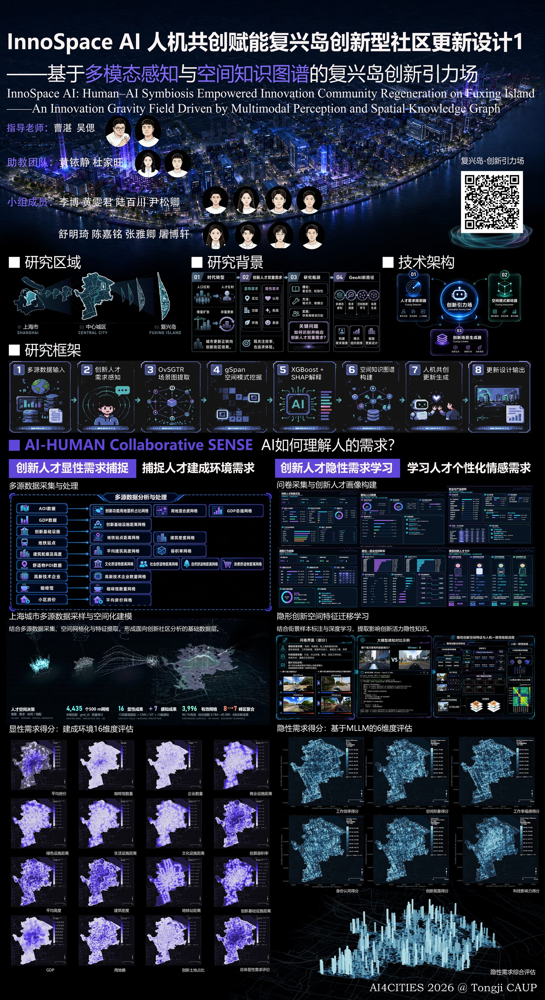
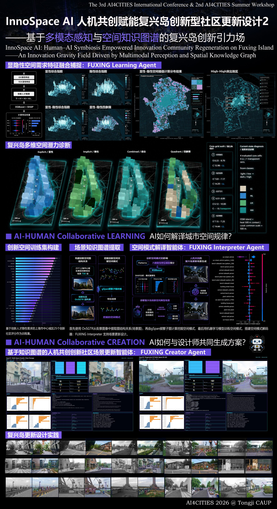

<div align="center">

# FUXING ISLAND · INNOVATION GRAVITY FIELD

### 复兴岛 · 创新引力场

**From Data Diagnosis to Spatial Activation — Multi-modal Indicator-based Innovation Space Identification**

**从数据诊断到空间激活 —— 基于多模态指标的创新空间识别**

An AIGC decision-support platform for urban renewal (AI4Cities) · Vue 3 + Vite static SPA

[](https://vuejs.org/)
[](https://vitejs.dev/)
[](https://threejs.org/)
[](https://echarts.apache.org/)
[](https://maplibre.org/)

[](LICENSE)

</div>

---

## 🌐 Vision · 项目愿景

Urban renewal has long suffered from a gap between **quantitative diagnosis** and **design action**: planners can measure a city, but struggle to trace *why* a space underperforms and *what* an intervention will look like before it is built. We built this platform to close that gap.

**EN.** We present an end-to-end, evidence-chained pipeline that couples a **dual-dimension indicator system** (15 explicit physical + 6 implicit perceptual measures) with **scene-graph spatial inference** (OvSGTR → gSpan → XGBoost → TreeSHAP) and **AIGC counterfactual generation**, producing auditable *Before / Planned / Observed* evidence for every design intervention. The methodology is trained and validated on **Shanghai's central city** (4,435 grids at 500 m × 500 m resolution) and generalized to **Fuxing Island** as a four-zone innovation activation strategy.

城市更新长期存在「量化诊断」与「设计行动」之间的断层：规划者能测量城市，却难以追溯空间为何低效、干预建成后会呈现何种面貌。本平台以**显/隐双维指标体系**（15 项显性物理指标 + 6 项隐性感知指标）为诊断基底，串联 **OvSGTR 场景图空间推理 → gSpan 频繁子图挖掘 → XGBoost 空间打分 → TreeSHAP 贡献归因**方法链，并以 **AIGC 反事实生成**输出可追溯、可复现、可审计的 **Before / Planned / Observed 三态证据链**。方法在上海市中心城区（4,435 个格网、500 m × 500 m 分辨率）完成训练与验证，并泛化应用于复兴岛四大更新分区。

> **Positioning:** an academic-grade, fully client-side decision-support system — every dataset ships with the repository; the only runtime network dependencies are CartoDB basemap tiles and Google Fonts.

---

## 🖼️ Exhibition Poster · 学术展板

<div align="center">
  
  
</div>

---

## ✨ Highlights · 核心亮点

| # | Highlight | 要点 |
|---|-----------|------|
| 1 | **Dual-dimension indicator system** — 15 explicit structural-geospatial measures + 6 implicit VLM/LLM street-view perceptual measures, unified at 500 m grid scale | 显/隐双维 21 项指标，500 m 格网统一建模 |
| 2 | **Interpretable spatial scoring** — OvSGTR scene graphs → 221 gSpan pattern-count features → XGBoost (CV R² 0.6209) → TreeSHAP attribution | 可解释空间打分方法链，SHAP 归因到子图模式 |
| 3 | **Three-state AIGC evidence chain** — every intervention is auditable across Before (defect diagnosis) / Planned (counterfactual) / Observed (built outcome) states | 三态证据链：缺陷诊断 → 反事实计划 → 实景对比 |
| 4 | **Street-view perception at scale** — 13,000 street-view images encoded by a transfer-learned ResNet18 into 6 implicit dimensions | 13,000 张街景经 ResNet18 迁移学习提取六维感知 |
| 5 | **Four-quadrant diagnosis** — HH / LH / LL / HL typology with statistically defined tertile thresholds and academic metadata | 四象限诊断，三分位阈值与学术元数据随 GeoJSON 发布 |
| 6 | **Geodesy in the browser** — built-in Gauss–Krüger EPSG:4549 (central meridian 120°) ↔ WGS84 forward/inverse transforms | 前端内置 CGCS2000 高斯-克吕格正反算 |
| 7 | **Engineering rigor** — bilingual UI, mobile degradation strategy, fault-tolerant map loading, container-isolated charts | 双语、移动端降级、地图容错、图表容器隔离 |

---

## 🧭 System Overview · 系统总览

The platform is organized as four routes, each mapping to one stage of the research narrative.

平台由四个页面构成，对应科研叙事的四个阶段。

| Module | Route | Role | Key Capabilities |
|--------|-------|------|------------------|
| **Above** | `/above` (`/` redirects) | Landing & gallery | Full-screen scroll-snap hero (50 particles, 20 on mobile); **15-group Before vs. AIGC Restoration comparison gallery** (clip-path slider, rAF-throttled, IntersectionObserver autoplay on desktop); **Three.js 3D scene** — CartoDB `dark_nolabels` tiles at zoom 15 (961 tiles desktop / 121 mobile), four GeoJSON layers (boundary, parks, roads, height-graded extruded buildings with emissive), 3.5 s cinematic camera fly-in, graceful mock fallback |
| **Generate** | `/generate` | OvSGTR Spatial Inference & AIGC Refinement | Model-training overview (method chain, metrics, SHAP Top-20, pattern leaderboards); **8 GPS-tagged renewal cases** on MapLibre GL (clustered, 4 spatial typologies × 2); single-case **three-state evidence chain** with SVG detection overlays, Cytoscape scene graphs, Plotly SHAP waterfalls, and diagnosis reports |
| **Analyze** | `/analysis` | Talent Demand Detector — data intelligence dashboard | **21 indicators** (15 explicit + 6 implicit) rendered as ECharts geo custom polygons on a locally registered Shanghai map; live MEAN/STD/HIGH/LOW statistics; histogram / trend / quartile / donut chart suites; ResNet18 perception pipeline view; **four-quadrant region map** with click-linked detail cards; 16 sampled street-view training samples with six-dimension radar profiles |
| **Method** | `/method` | Five-chapter methodology narrative | Research framework → indicator system (15 explicit + 6 implicit) → technical implementation (LLM/VLM scoring + DBSCAN clustering) → AIGC generation (6-node evidence chain) → generalization to Fuxing Island's four zones |

四页面各司其职：**Above** 承担落地展示（对比画廊 + Three.js 三维场景）；**Generate** 承担模型与案例推理（训练概览 + GPS 案例 + 三态证据链）；**Analyze** 承担数据智能（21 指标格网大屏 + 四象限诊断 + 样本雷达）；**Method** 承担方法论叙事（五章节，vue-i18n 驱动）。

---

## 🔬 Scientific Method · 科学方法

### 1. Dual-Dimension Indicator System (15 + 6 = 21)

**EN.** We measure innovation-space vitality along two orthogonal dimensions. The **15 explicit indicators** are structural geospatial measures — building density, average building height, café count (informal interaction vitality), consumer/cultural/infrastructure/metro/natural/social accessibility, FAR proxy, grid-level GDP (multi-source remote-sensing estimate), high-tech enterprise count, mean housing price, innovation land share, and land-use Shannon entropy. The **6 implicit indicators** are six-dimensional semantic vectors of human-centered perceptual qualities — place identity, innovation atmosphere, spatial image aesthetics, technology influence, work efficiency, and work wellbeing — corresponding to questionnaire scales.

> *"隐性感知测度指标均由视觉大语言模型 (VLM/LLM) 深入提取街景图像中表现人本交往氛围特征的六维语义矢量聚合产生。"*
>
> The implicit perceptual measures are aggregated from six-dimensional semantic vectors extracted by vision/large language models from street-view imagery, capturing the human-centered interaction qualities of each place.

显性维度刻画「空间结构」（用地、密度、可达性等 15 项），隐性维度刻画「人本感知」（场所认同、创新氛围、空间意象、科技渗透、工作效率、工作幸福感 6 项），与问卷量表一一对应。

<details>
<summary><b>Full indicator list · 完整指标清单（15 显性 + 6 隐性）</b></summary>

| Explicit (15) | 释义 |
|---|---|
| `x1_bldg_density` | 建筑密度（建筑基底面积 / 格网面积） |
| `x1_avg_height_m` | 平均建筑高度 |
| `x1_cafe_count` | 咖啡馆数量（非正式交流网络活力） |
| `x1_consumer_nearest_m` | 最近消费可达性 |
| `x1_cultural_nearest_m` | 最近文化可达性 |
| `x1_far_proxy` | 容积率代理 |
| `x1_gdp_grid_value` | GDP 格网产值（多源遥感估算） |
| `x1_hightech_count` | 高新技术企业数 |
| `x1_house_price_mean` | 住宅均价 |
| `x1_infra_nearest_m` | 市政基础设施距离 |
| `x1_innov_land_share` | 创新用地比例 |
| `x1_landuse_shannon` | 土地利用多样性熵（香农熵） |
| `x1_metro_nearest_m` | 地铁站距离 |
| `x1_natural_nearest_m` | 绿地水体可达性 |
| `x1_social_nearest_m` | 社交可达性 |

| Implicit (6) | 释义 |
|---|---|
| `x2_questionnaire_identity` | 场所认同感（社区归属与地方依恋） |
| `x2_questionnaire_innovation_atmos` | 创新氛围感知 |
| `x2_questionnaire_spatial_image` | 空间意象美感（美学质量与地标感） |
| `x2_questionnaire_tech_influence` | 科技渗透感知 |
| `x2_questionnaire_work_efficiency` | 工作效率感知 |
| `x2_questionnaire_work_wellbeing` | 工作幸福感（户外舒适性与减压体验） |

</details>

### 2. Street-View Perception Pipeline · 街景感知管线

```
13,000 street-view images
        │
        ▼
ResNet18 (ImageNet-pretrained, frozen backbone, 512-d embedding)
        │
        ▼
Multi-task regression head — transfer learning (FC 512 → 6, MSE loss)
        │
        ▼
6 implicit indicator dimensions
        │
        ▼
Interpolated onto 500 m × 500 m grids (EPSG:4549)
```

13,000 张街景图像经 ImageNet 预训练、冻结主干的 ResNet18 提取 512 维嵌入，再由多任务回归头（FC 512→6，MSE 损失）迁移学习得到六维隐性指标，插值至 500 m 格网（EPSG:4549 坐标系）。

### 3. Interpretable Spatial Scoring · 可解释空间打分方法链

```
Scene Image → OvSGTR Scene Graph → gSpan Frequent Subgraph Mining
→ Pattern-count Featurization → XGBoost Spatial Scoring → TreeSHAP Contribution Analysis
```

| Item | Value |
|------|-------|
| Training images | **1,200** |
| gSpan pattern-count features | **221** |
| Cross-validation RMSE | **1.4048** |
| Cross-validation R² | **0.6209** |
| Holdout R² / RMSE | **0.6117** / **1.4222** |
| XGBoost hyperparameters | `n_estimators=600, max_depth=4, learning_rate=0.03, subsample=0.9, colsample_bytree=0.8, reg_lambda=5` |

**EN.** Rather than a black-box regressor, we featurize each scene as counts of 221 frequent subgraph patterns mined by gSpan from OvSGTR scene graphs. XGBoost learns the mapping from pattern counts to spatial scores, and TreeSHAP attributes every prediction back to individual subgraph patterns — producing ranked positive/negative spatial-pattern leaderboards (Top-10 each, with mean SHAP value, support, frequency, and SVG subgraph icons) that designers can inspect and act upon.

我们不使用黑盒回归：每个场景被表征为 OvSGTR 场景图中 221 个 gSpan 频繁子图模式的计数向量，XGBoost 学习「模式计数 → 空间得分」映射，TreeSHAP 将每次预测归因至具体子图模式，产出正/负向空间模式排行榜（各 Top10，含 SHAP 均值、support、频数与 SVG 子图图标），供设计者审查与操作。

### 4. Four-Quadrant Diagnosis · 四象限诊断

**EN.** Crossing the explicit and implicit dimensions at statistically defined tertile thresholds yields a four-quadrant typology of innovation space. These categories describe the **relative distribution within the study area — not absolute standards**; this caveat ships as academic metadata inside the GeoJSON itself.

| Quadrant | Name | Meaning | Color |
|----------|------|---------|-------|
| Q1 | **HH** 双高 | High explicit & high implicit | Blue |
| Q2 | **LH** 感性 | Low explicit & high implicit | Cyan |
| Q3 | **LL** 双低 | Low on both dimensions | Gray |
| Q4 | **HL** 理性 | High explicit & low implicit | Copper |

| Statistic | Explicit | Implicit |
|-----------|----------|----------|
| Tertile low threshold | ≤ 0.067274 | ≤ 0.075824 |
| Tertile high threshold | > 0.086580 | > 0.082010 |
| Median | 0.07554 | 0.07901 |

The **HH region** covers **1,099 grids (270.114 km²)**. Clicking any quadrant in the dashboard reveals per-quadrant detail cards (grid count, area, dimension medians) and six-dimension radar profiles of the 16 sampled training sites (4 per quadrant), each with georeferenced street-view imagery and hundred-scale scoring bars.

以三分位阈值交叉显性/隐性两维，得到 HH（双高）/ LH（感性）/ LL（双低）/ HL（理性）四象限类型学；类别为研究区**相对分布**而非绝对标准，该声明已作为学术元数据写入 GeoJSON。HH 区共 1,099 个格网、270.114 km²。

### 5. Three-State AIGC Evidence Chain · 三态证据链

```
ORIGINAL → STRUCTURE → TRAIN → EDIT → GENERATE → EVALUATE
```

**EN.** Every one of the **8 GPS-tagged renewal cases** (2 waterfront, 2 public-space, 2 aging-factory, 2 idle-structure) carries an auditable three-state chain:

- **Before** — defect diagnosis: OvSGTR detection boxes (SVG overlays), scene semantic graph (Cytoscape, ≤32 nodes, click-to-trace back to scoring patterns), and a spatial diagnosis report enumerating defects, actions, and outcomes.
- **Planned** — counterfactual plan: What-If structure editing driven by a library of **40 optimization actions** (e.g., `maker_lab_frontage`) in three action classes — weakening negative patterns, strengthening nodes, weakening relations — each carrying an AIGC `prompt_fragment` for diffusion-based image generation, with a predicted gain (e.g., 4.650 → 4.790).
- **Observed** — built outcome: before/optimized imagery with an interactive slider comparison and the observed score (e.g., → 5.864), reporting both `planned_gain` and `actual_gain`.

Each case directory contains exactly **8 files** (`before.jpg`, `observed.png`, `optimized.png`, `case_manifest.json`, `graph_ui.json`, `waterfalls.json`, `observed_after_report.json`, `trace_index.json`). When a report is missing, the UI degrades by rule-based synthesis under an explicit **"no fabrication"** constraint (enforced in code comments). Three validation cases quantify observed gains: **+38% density, +45% green cover, +60% diversity**.

8 个 GPS 案例（滨水 ×2 / 公共空间 ×2 / 老旧厂房 ×2 / 闲置构筑物 ×2）均具备可审计的三态链：Before 缺陷诊断（检测框叠加 + 语义图 + 诊断报告）、Planned 反事实计划（20 余种优化动作、三类动作体系、AIGC 提示语片段与预测增益，如 4.650→4.790）、Observed 实景对比（滑块对比与实测得分，如 →5.864，同时报告 planned_gain 与 actual_gain）。每案例目录固定 8 个文件；报告缺失时按规则降级生成，代码层明确「不得伪造」。三个验证案例量化增益：密度 +38%、绿覆率 +45%、多样性 +60%。

---

## 🏗️ Architecture & Engineering · 架构与工程亮点

**EN.** The system is a fully client-side Vue 3 SPA — there is no backend; all datasets ship as static assets. Engineering decisions follow the data, not fashion:

| Domain | Decision | 中文说明 |
|--------|----------|----------|
| Internationalization | **Dual i18n systems** — a custom `useLang` composable (~850-line dictionary) plus `vue-i18n` (Method page), synchronized through the NavBar capsule toggle with `localStorage` persistence | 自研 useLang + vue-i18n 双体系，导航栏胶囊按钮同步切换并持久化 |
| Geodesy | **In-browser EPSG:4549 → WGS84** forward/inverse Gauss–Krüger transforms (CGCS2000, central meridian 120°) via `coordTransform.js` — no projection service required | 前端实时完成 CGCS2000 高斯-克吕格正反算 |
| Map resilience | `mapLoader.js` fault-tolerance chain: singleton Promise + AbortController 10 s timeout + structural validation + retry overlay; center-decay mock fallback when data fails | 地图本地化 + 容错链 + 失败重试遮罩 + mock 兜底 |
| Chart isolation | `.map-chart-wrapper` container isolation (aspect-ratio 1/1, min 420 / max 620 px); Cytoscape auto-resizes via ResizeObserver | ECharts 容器隔离；语义图自适应尺寸 |
| Mobile degradation | 768 px-dominant responsive system (~30 media queries, additional 480–1200 px tiers): tile grid 961 → 121, `pixelRatio ≤ 1.5`, pan disabled, gallery autoplay off, hero particles 50 → 20, `--navbar-h` 80 → 64 px | 以 768px 为主导断点的系统性移动端降级 |
| Performance | Route-level code splitting; Three.js initializes only when scrolled into view (IntersectionObserver); asynchronous tile loading; Cytoscape ≤ 32 nodes; trend charts sampled to ≤ 50 points; rAF-throttled drag interactions | 路由级代码分割、到屏初始化、异步瓦片、节点/采样上限、rAF 节流 |
| Visual system | `#0a1628` deep-space blue base · `#005BAC` primary blue · `#00B5D8` cyan · `#B8742A` copper; glassmorphism cards; Syncopate / JetBrains Mono / Outfit typefaces | 深蓝 + 主蓝 + 青 + 铜四色体系，毛玻璃卡片 |

平台为纯前端静态 SPA，无后端；全部数据以静态资产随仓库发布。工程取舍以数据与科研可复现性为准绳：双语、测地学、容错、性能与移动端均有显式策略。

---

## 📦 Data Assets · 数据资产

All paths below live under `public/` and are served locally with the build.

| Asset | Contents |
|-------|----------|
| `public/cases_data/` | `catalog.json` (8 cases, V3), `model_training_overview.json`, `fit_predictions.json` (1,200 predicted-vs-actual pairs), `raw_shap_importance.json`, positive/negative pattern lists (30 entries each, UI shows Top-10), `pattern_icons/`, and `cases/case_01`–`case_08` (8 files each) |
| `public/data/` | `shanghai_full.json` (Shanghai boundary), `boudanry.geojson` (study-area boundary — filename typo preserved from source), four Fuxing Island GeoJSON layers (boundary, height-attributed buildings, roads, parks), `explicit/` (15 indicator GeoJSONs), `implicit/` (6 indicator GeoJSONs), `region/` (four-quadrant and related region files, 8 total) |
| `public/gallery/` | 15 before/after comparison pairs (IDs 001, 002, 006, 008, 019, 020, 021, 033, 034, 051, 053, 057, 063, 065, 067) |
| `public/pictures/` | 16 sampled sites with 16 georeferenced street-view images (location + heading) |
| Runtime externals | CartoDB `dark_nolabels` basemap tiles + Google Fonts — **everything else is local** |

---

## 🛠️ Tech Stack · 技术栈

| Layer | Technology | Version |
|-------|-----------|---------|
| Framework | Vue (Composition API + `<script setup>`) | ^3.4.21 |
| Build | Vite | ^5.2.8 |
| Routing | Vue Router (HTML5 history, lazy-loaded routes) | ^4.3.0 |
| Charts & geo | ECharts (geo maps + all statistical charts) | ^5.5.0 |
| 3D scene | Three.js | ^0.162.0 |
| Semantic graphs | Cytoscape | ^3.34.0 |
| SHAP waterfalls | Plotly.js (dist-min) | ^3.7.0 |
| GPS maps | MapLibre GL | ^5.24.0 |
| I18n | vue-i18n (Method page) | ^9.14.4 |

---

## 🚀 Quick Start · 快速开始

```bash
# 1. Install dependencies · 安装依赖
npm install

# 2. Start the dev server · 启动开发服务器
npm run dev

# 3. Production build · 生产构建（输出 dist/）
npm run build

# 4. Preview the build locally · 本地预览构建产物
npm run preview
```

> [!IMPORTANT]
> **Deployment notes · 部署须知**
> - The router uses `createWebHistory` — your server must provide an **SPA fallback** (rewrite all routes to `index.html`).
> - All datasets are fetched via **absolute paths** — deploy at the **domain root** (`/`), not under a sub-path.
> - 路由使用 HTML5 history 模式，服务器需配置 SPA fallback；数据以绝对路径请求，需部署在根路径。

---

## 📁 Project Structure · 项目结构

```
ai4cities_web/
├── public/
│   ├── cases_data/        # 8-case evidence chains + model training assets
│   ├── data/              # boundaries, Fuxing Island layers, 21 indicator grids, regions
│   ├── gallery/           # 15 before/after comparison pairs
│   └── pictures/          # 16 sampled street-view training images
├── src/
│   ├── views/             # Above / Generate / Analyze / Method pages
│   ├── components/        # maps, charts, galleries, evidence-chain modules
│   ├── composables/       # custom useLang i18n, shared logic
│   ├── locales/           # vue-i18n dictionaries
│   ├── router/            # HTML5 history routes (lazy-loaded)
│   ├── utils/             # mapLoader.js, coordTransform.js, ...
│   ├── data/              # static UI data
│   ├── assets/            # fonts, icons, styles
│   ├── App.vue / main.js / i18n.js / style.css
├── index.html
├── vite.config.js
└── package.json
```

---

## 🗺️ Roadmap

- [ ] Extend the four-quadrant diagnosis to additional districts beyond the Shanghai central city study area
- [ ] Enlarge the GPS case library beyond the current 8 cases / 4 spatial typologies
- [ ] Broaden the optimization-action library (currently 40 actions across 3 action classes)
- [ ] Serve the OvSGTR → gSpan → XGBoost → TreeSHAP chain as an online inference endpoint alongside the static build
- [ ] Multi-city generalization study following the Shanghai → Fuxing Island transfer protocol

---

## 📚 Citation

If you use this platform or its datasets in academic work, please cite the software:

```bibtex
@software{fuxingdao_innovation_gravity_field,
  title   = {Fuxing Island · Innovation Gravity Field: An AIGC Decision-Support
             Platform for Urban Renewal (AI4Cities)},
  author  = {{AI4Cities Research Team}},
  year    = {2026},
  url     = {https://github.com/Eric-Chenjm/AI4city_Web},
  note    = {Vue 3 + Vite static SPA; dual-dimension indicator system (15 explicit +
             6 implicit), OvSGTR--gSpan--XGBoost--TreeSHAP spatial scoring, and
             three-state AIGC evidence chains},
  license = {MIT}
}
```

---

## 📄 License

This project is released under the **MIT License**. See [LICENSE](LICENSE) for details.

本项目以 MIT 许可证发布。

---

## 🙏 Acknowledgments

**EN.** We thank the open-source communities behind Vue, Vite, Three.js, ECharts, Cytoscape, Plotly, and MapLibre GL; CARTO for the `dark_nolabels` basemap tiles; and Google Fonts for the Syncopate / JetBrains Mono / Outfit typefaces. We are equally grateful to the authors of OvSGTR, gSpan, XGBoost, TreeSHAP, ResNet, and DBSCAN — the methodological pillars on which this platform stands.

感谢 Vue、Vite、Three.js、ECharts、Cytoscape、Plotly、MapLibre GL 开源社区；感谢 CARTO 提供的 `dark_nolabels` 瓦片底图与 Google Fonts 字体服务；感谢 OvSGTR、gSpan、XGBoost、TreeSHAP、ResNet、DBSCAN 等方法学基石的原作者。

<div align="center">

**AI4Cities · From Data Diagnosis to Spatial Activation**

**从数据诊断，到空间激活。**

</div>
